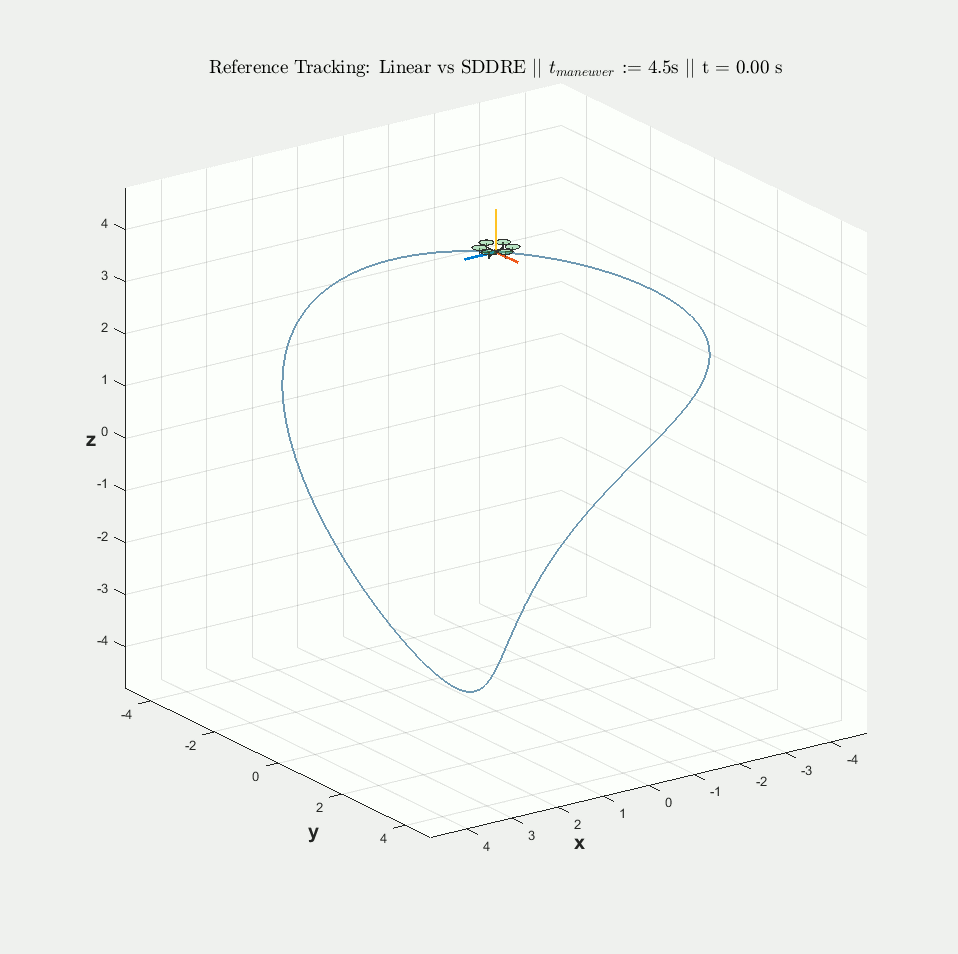
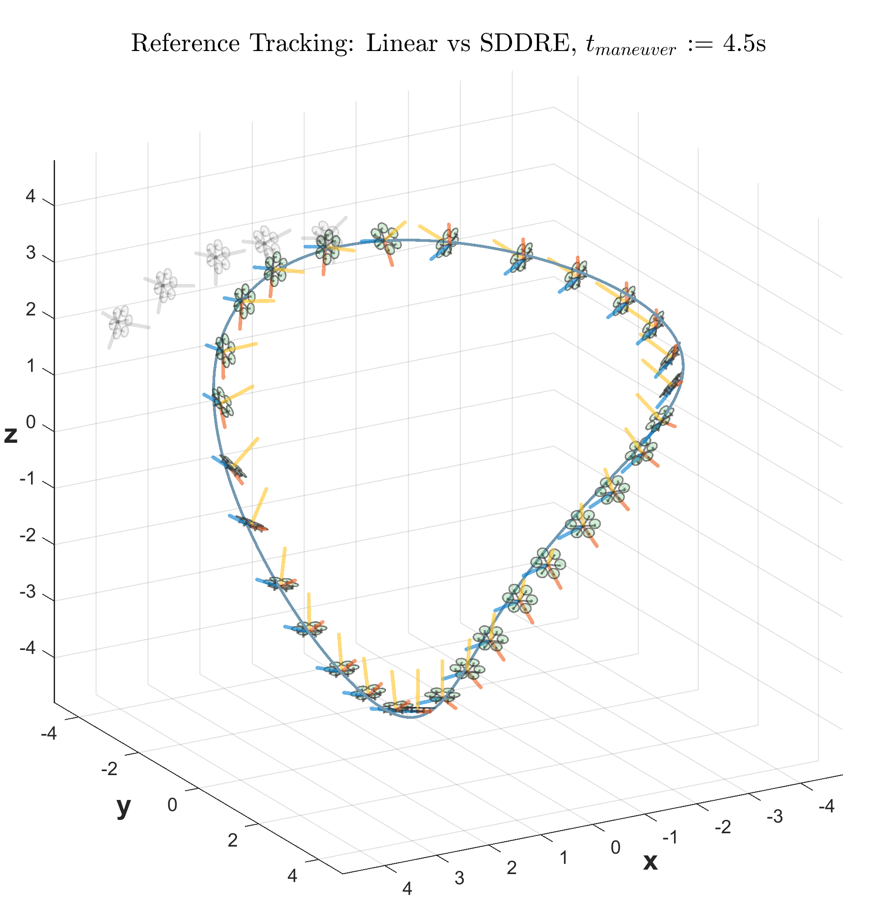
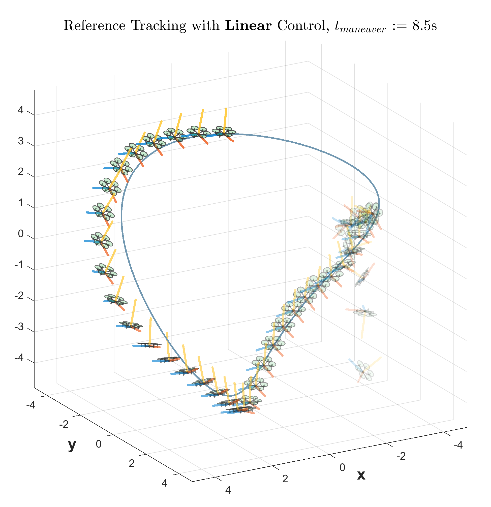
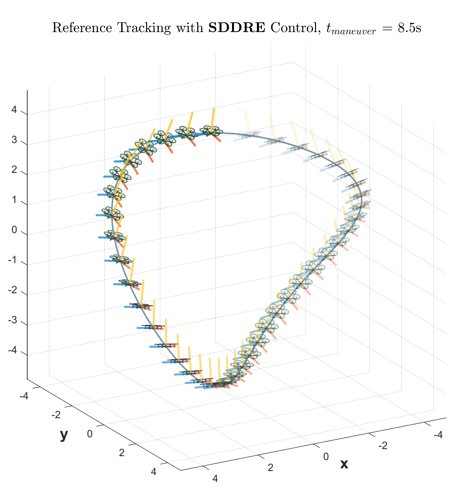
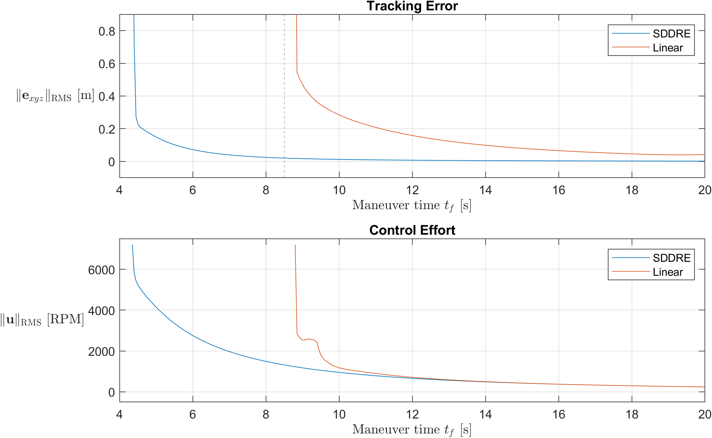
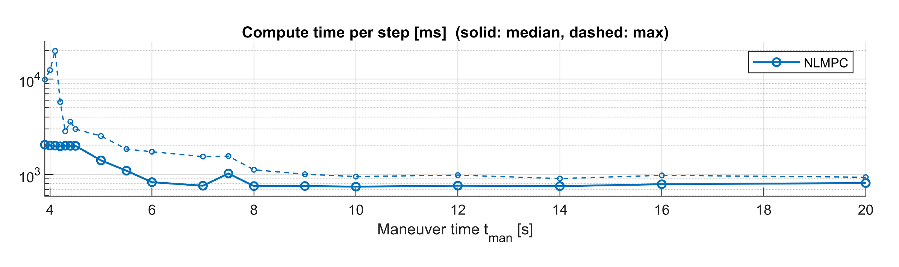

# SD-OPT: Nonlinear near-optimal tracking

<table>

<!-- <tr>
  <th width="50%" align="center" style="text-align:center">Linear control (Linear Quadratic Tracking)</th>
  <th width="30%" align="center" style="text-align:center">SDDRE-based control</th>
</tr> -->

<tr>
  <td align="center">
    <br>
    Demonstration: aggressive trajectory tracking under Linear MPC (dark grey) versus the proposed nonlinear algorithm SD-OPT (coloured) — demonstrated on a hexacopter plant. Note that Linear MPC diverges and is only visible briefly (t≤1.0s).
  </td>
  <!-- <td align="center">
    <br>
  </td> -->
</tr>

</table>

<sub><b>NB:</b> the hexacopter is shown at 1.5× scale for improved visibility, which can make the trajectory appear smaller than it is; refer to the x/y/z axes for the true scale. Units: [m].</sub>

---

**SD-OPT ("State Dependent Optimal Preview Tracking"): nonlinear near-optimal tracking** — a receding-horizon nonlinear tracking controller with reference preview, warm-started Riccati solves, and graceful degradation by construction. Key features:
- **Sub-millisecond per step**: faster than the linear MPC benchmark (0.5ms vs 4ms per-step).
- Tracking performance often **exceeds nonlinear MPC** — a surprising (and perhaps alarming) result — but this is due to the formulation, explained further on (Results, (2)).
- Fixed-cost and readily-implementable **linear algebra replaces solving a QP/NLP online**: bounded compute with no dependence on solver convergence, initial guesses, or feasibility.

---

SD-OPT is a receding-horizon controller in the same structural family as linear and nonlinear MPC – both used as benchmarks – but closer in design philosophy to optimal preview control and LQT: extending linear quadratic tracking to nonlinear dynamics, while keeping compute overhead low enough for embedded deployment, and maintaining reliability across the full operating envelope.

The key mechanisms are SDC parametrisation and a blend of infinite/finite horizon control (optimal preview control). Nonlinear dynamics are expressed as a state-dependent linear system, which allows the full LQT machinery (Riccati solves, preview feedforward) to apply at each step. The infinite/finite horizon blend allows for warm-started DARE solves, as well as an OCP formulation that's more faithful to the actual tracking objective.

Suitable for real-time applications and reliable deployment - designed with embedded systems and timing-critical contexts in mind.


## Quickstart


See `demo_SDOPT.m` for an illustration of the main work. Here you can run the SD-OPT controller over a test trajectory, inspecting the results — feel free to experiment with maneuver time `t_man`, sample rate `Ts`, `PreviewHorizon`, cost matrices, as well as the actual reference trajectory to be tracked.

The demo currently tests three controllers across the chosen trajectory:
1. LQT
2. SD-OPT
3. NLMPC (if precomputed data exists - MATLAB NLMPC is too slow to run side by side in the demo script. See `/data/nlmpc_*.mat` for the precomputed available - it's currently a comprehensive set across maneuver times, using fixed parameters Ts = 20Hz and PredHorizon = CtrlHorizon = 2.0 s).


### Requirements

- MATLAB R2021a or newer (name–value function-call syntax)
- Control System Toolbox (optional; the default `dare`/`dlyap` solvers are standalone)


## Motivation
Optimal tracking controllers face a familiar tradeoff:

- **Linear** (LQR/LQT/Linear MPC) designs are cheap, certifiable, and well understood — but they are coupled to the hover linearisation. Once a maneuver demands sustained large attitude excursions, the small-angle model is simply wrong, and tracking eventually collapses.

- **Nonlinear** MPC handles the *full dynamics and constraints* — at the price of an online NLP whose solve time varies with iteration count, active-set changes, and initialisation quality. For a flight controller, worst-case timing is what matters, and it is hard to bound across the flight envelope, without RTI-class machinery and the engineering it entails. While backed by strong theory, practically NLMPC performance can be sensitive to numerical conditioning, prediction horizon, control horizon, and solver iteration limits; further, these parameters often require re-adjustment as the sampling time or operating regime changes. Most crucially however, an infeasible problem at any timestep leaves the plant with at best stale inputs, at worst an irrecoverable program and complete open-loop instability – and this failure tends to occur in exactly the high-demand conditions where precise and *reliable* control is most needed.

SDRE-family methods occupy the middle ground: they keep the LQ structure (its tooling, intuition, and practical compute) while re-'linearising' exactly at every step via an SDC (State Dependent Coefficient) factorisation, $\dot{x} = A(x)x$. The contribution here is an optimal preview control formulation of that idea.

The proposed approach replaces online nonlinear programming with a fixed sequence of Riccati-based computations: this computational workload is numerically robust, lightweight, consistent throughout the operating envelope, and fully characterisable a priori. The net result is a reliable controller with near-optimal nonlinear tracking, capable of consistent sub-millisecond loop rates – and consistent right up until its genuine failure point.


## Results: SD-OPT versus MPC (Linear and Nonlinear)

The main test trajectory is a 3D maneuver along a closed path of ≈30 m arc length:
```math
r(t) = 4\,[\sin\omega t,\ -\cos\omega t \sin\omega t,\ \cos\omega t], \quad \omega = 2\pi/t_f
```

swept over duration $t_f \in [4, 20]$ s. The duration $t_f$ is a parameter which sets the 'aggressiveness' of the maneuever.

Controllers are subject to the same cost matrices $R, Q_y, Q_y^f$, with $Q_y^f$ set via the usual DARE solution. Tracking performance is assessed via the LQ tracking cost, RMSE tracking error, terminal tracking error, and RMSE actuator effort. 


> **Terminology.** "SDDRE" (State Dependent Differential Riccati Equation) appears in some figures and originates from early work based on Khamis & Naidu's finite-horizon SDRE tracking framework [2], formulated in continuous time. Two differences in nomenclature: SD-OPT works in discrete time with *difference* equations and an *algebraic* Riccati equation – SDDRE is strictly a misnomer, conveying SD-OPT's lineage, but retained as a useful shorthand.


<table align="center">
  <tr>
    <th width="50%" align="center" style="text-align:center">Linear control</th>
    <th width="50%" align="center" style="text-align:center">SDDRE-based control</th>
  </tr>
  <tr>
      <td align="center">
      <br>
      </td>
      <td align="center">
      <br>
      </td>
  </tr>
  <tr>
      <td align="center" colspan="2">
      <br>
      </td>
  </tr>
</table>


**Key results**

(1) Compared to the baseline linear method, the SDDRE-based method improves tracking error, extends the usable range of actuator authority, and enables more aggressive maneuvering. On a fixed-shape maneuver swept over duration $t_f$, the linear controller loses the trajectory below $t_f \approx 8.5$ s, while SDDRE tracks down to $t_f \approx 4.5$ s – roughly a 2× expansion of the feasible maneuver envelope, i.e. **capable of handling a ~4× higher acceleration demand**, along with general improvements in tracking error and control effort across the envelope – and notably, still at a linear-like compute.


(2) Tracking performance **exceeds nonlinear MPC** in most cases – a counterintuitive result, but this is due to the formulation. Both controllers see the same finite preview window, however MPC always assumes the tracking problem ends at the end of its preview window and applies the terminal cost $Q_y^f$:

$$ \min_{\{u_k\}} \sum_{k=0}^{p-1} (e_k^T Q_y e_k + u_k^T R u_k) + e_p^T Q_y^f e_p \quad \text{subject to (dynamical equations of system)}, \quad e_k = y_k - r_k = Cx_k - r_k $$

where $p$ is the length of the preview horizon — while SD-OPT's reference preview flows through an infinite-horizon structure, better approximating the actual tracking objective:

$$\min_{\{u_k\}} \sum_{k=0}^{N-1} (e_k^T Q_y e_k + u_k^T R u_k) + e_N^T Q_y^f e_N$$

where $N$ is the length of the full trajectory reference. This better encodes the knowledge that *the tracking task continues beyond its preview window*, hence yielding an overall lower tracking error (RMSE). The exact finite-horizon problem is also recovered as the terminal state enters the window, yielding correct terminal behaviour — something not naturally handled by receding-horizon MPC. In spirit, SD-OPT solves the problem people actually want from MPC (optimal tracking over the full reference) but it does so in an efficient/implementable algorithmic form (a receding-horizon controller).

(3) SD-OPT also **avoids the pathologies** of online nonlinear optimisation. Near the feasibility boundary, a NLP becomes sensitive to the initial guess, suffers iteration blow-up, and solve effort grows sharply. The solver may report infeasibility that reflects its search path and the nonlinear landscape, rather than the problem itself. Further, a single failed solve – whether from a genuinely infeasible problem, iteration blowup, or not being able to compute the control within the required time limit – leaves the controller without a valid input mid-flight, often leading to full collapse of the controller, precisely when responsive control inputs are most needed.

<table align="center">
  <tr>
      <td align="center" colspan="2">
      <br>
      Nonlinear MPC solve times. As the maneuver becomes more aggressive, per-step solve time becomes more inconsistent – least predictable exactly where it matters most.
      </td>
  </tr>
</table>

SD-OPT's per-step cost, in contrast, is fixed linear algebra with deterministic guarantees — identical at every step, everywhere in the envelope — which is what makes it reliable, in real-time and across the operating envelope.


### Numeric results.

| *Maneuver time* | 4.5s | 4.75s | 5.0s | 6s | 8s | 10s | 20s | |
|---|---|---|---|---|---|---|---|---|
| **Per-step compute [median]** | — | — | — | — | — | 4.0ms | 4.0ms | *Linear MPC* |
| | 2.0s | 1.7s | 1.4s | 0.8s | 0.8s | 0.7s | 0.8s | *Nonlinear MPC* (‡) |
| | **0.7ms** | **0.6ms** | **0.6ms** | **0.5ms** | **0.5ms** | **0.6ms** | **0.4ms** | **SD-OPT** |
| **Tracking error [RMSE]** | — | — | — | — | — | 18cm | 2.1cm | *Linear MPC* |
| | 17.3cm | 11.5cm | 9.9cm | 5.8cm | 2.8cm | 1.8cm | 0.6cm | *Nonlinear MPC* |
| | **19.5cm** | **11.4cm** | **9.2cm** | **4.3cm** | **1.4cm** | **0.8cm** | **0.2cm** | **SD-OPT** |
| **Tracking error at terminal** | — | — | — | — | — | 46.8cm | 14.5cm | *Linear MPC* |
| | 74.1cm | 68.8cm | 64.1cm | 49.5cm | 34.5cm | 27.2cm | 13.5cm | *Nonlinear MPC* |
| | **13.9cm** | **10.9cm** | **7.0cm** | **3.0cm** | **5.8cm** | **4.5cm** | **1.2cm** | **SD-OPT** |

> (‡) NB: despite the gap, the NLMPC comparators were fully optimised for performance, ensuring a fair (but still MATLAB-to-MATLAB based) timing comparison:
> - Analytic derivatives throughout – symbolic Jacobians generated for the nonlinear MPC prediction model (no finite differencing), all accessed via (cached) numerical functions.
> - Numerical balancing applied – reduced mean per-solve iterations from ~130 to ~30.
> - SQP solver with warm starting – tuned for both speed and recovery after infeasibility.
> - Optimality tolerances reduced to eliminate unnecessary optimisation (without affecting tracking performance).
> - MEX compilation and multiple-shooting formulations (sparse nlmpcMultistage) were both implemented and tested but only yielded gains under solver configurations that weren't viable (CGMRES and near-kHz sample rates).
> 
> Final timing was validated via MATLAB Profiler; flame-graph analysis confirmed the NLP solve, not other MATLAB overhead, dominated compute in all cases, and the timing figures are reliable as a MATLAB baseline.
>
> The slow NLMPC solve times are largely due to MATLAB's NLP solver being general purpose (not optimised for NLMPC problems), and the long horizon (2.0 seconds at 20Hz, p=40 steps) on a 12 state, 6 input system – a relatively large optimisation problem – and the unstable open loop dynamics also contribute (they yield a difficult landscape for nonlinear optimisation, particularly over long horizons). 


## SD-OPT: Per-step algorithm

At step $k$, with measured state $x_k$ and previous input $u_{k-1}$:

1. **Factorise & discretise.** $`A_k = A(x_k)`$, $`B_k = B(u_k) \approx B(u_{k-1})`$; ZOH-discretise at $`T_s`$.
2. **Riccati solve (warm-started).** Solve the DARE

```math
P = A^TPA - A^TPB(R + B^TPB)^{-1}B^TPA + C^TQ_yC
```

for $`P_{ss}`$ using Cascade Newton–Kleinman (C-NK): initialise from the previous step's $`P_{ss}`$, then iterate

```math
K \leftarrow (R + B^TPB)^{-1}B^TPA, \quad P \leftarrow \mathrm{dlyap}\big((A - BK)^T,\ Q + K^TRK\big)
```

Because consecutive SDC models differ little, a few iterations typically suffice. Set $`K_{ss}`$, $`A_{cl} = A - BK_{ss}`$.

3. **Preview feedforward.** Over a receding window of $`p`$ steps, run the costate recursion $`v \leftarrow A_{cl}^T v + C^TQ_y\,r_{k+j}`$ backwards from the seed

```math
v_{k+p} = (I - A_{cl}^T)^{-1} C^T Q_y\, r_{k+p}
```

The control is then

```math
u_k = -K_{ss}\,x_k + (R + B^TP_{ss}B)^{-1}B^T v_{k+1}.
```

4. **Terminal regime.** Once the window reaches the end of the trajectory ($`k + p \ge N`$), the controller switches to the **full finite-horizon difference-Riccati recursion** from $`C^TQ_{yf}C`$ so the gains ramp correctly into the terminal cost.


### Efficient compute

Instead of solving a quadratic program from scratch at each iteration, SD-OPT uses an *analytic approach* based on Riccati equations; this admits warm-starting that a general interior-point QP solver does not. Solve time is lower than  linear MPC as a result, whilst also handling the nonlinear dynamics.

Further, warm-starting removes 75-80 % of the compute required to solve the DARE:

| DARE solver | Cost per step | Cost trend with loop rate |
|---|---|---|
| Cold `dlqr()` | ~2.4 ms | flat |
| Cold `idare()` | ~1.3 ms | flat |
| **Warm Newton–Kleinman (default)** | **~0.3 ms** | **flat / drifts down** (~0.3ms at 20Hz, ~0.25ms at 200Hz) |

What remains is dominated by the preview recursion and other overhead – which is still fixed cost, and cheap compared to a QP solve.


## How this solution was arrived at

This controller is the survivor of a broader exploration of the tracking problem, roughly in order:

- **Linear LQT** with an implicit-reference/feedforward split — excellent inside the small-angle regime, and the structural backbone everything else reuses.
- **Robust linear tracking** against the uncertainty polytope: brute-force minimax Riccati recursions, per-timestep LMI synthesis ($H_2$, $H_\infty$, guaranteed-cost; quadratic-stability vs parameter-dependent Lyapunov), trajectory-driven uncertainty-set construction. Effective for genuine uncertainty — but robustness to *known* effects from nonlinearity from large attitudes is the wrong tool: the linear model isn't uncertain there, it's wrong in a known way. While the practical payoff of a robust method working is huge (a fixed feedback gain Kr across the whole trajectory, and a simple LQT-like recursion for the feedforward), the conservatism it introduces proves too problematic.
- **Iterative methods**: iLQR - not suitable for online control. Improves tracking, but computationally heavy and trades away the properties that matter for flight code (convergence reliability, tuning burden, and efficient, predictable compute).
- **Nonlinear MPC** (`nlmpc`, and `nlmpcMultistage`): the accuracy ceiling when cost functions are fully equivalent, and a valuable benchmark — but with the online-NLP timing characteristics, compute cost, hyperparameter sensitivity, and convergence issues discussed above.
- **SDRE**, which keeps the LQ machinery, considers the exact nonlinear dynamics, previews the reference, and budgets its compute whilst maintaining reliability — the sort of approach this project was looking for.


## Future work

- Incorporate actuator constraints in the SD-OPT formulation. This is the main limitation of SD-OPT, and worth being clear about. Actuator constraints are not taken into account, and saturation yields the failure mode and suboptimal performance, visibly starting around when t_man ~ 4.7s. Incorporating actuator constraints is currently possible via a (not yet published) quadratic program formulation of SD-MPC; work remains integrating a similar mechanism in the warm-started SD-OPT pipeline.
- acados NLMPC comparison – a proper baseline for NLMPC. Runtime should be 1–2 orders of magnitude faster than MATLAB's `nlmpc`, and a proper comparison should use production-grade implementations of real-time iteration (RTI) or structure-exploiting SQP solvers, which are tuned to the problem class, rather than a general-purpose nonlinear solver applied to the unstructured problem. Beyond runtime, it's also worth revisiting the algorithmic behaviour of NLMPC itself under a production framework: the issues observed here (tendency toward local minima, difficulty converging, and infeasibility) were empirically characterised using MATLAB's SQP solver, with iteration limits and solve time deliberately left unconstrained to give the necessary recovery leeway; mature structure-exploiting solvers should handle this optimisation landscape more robustly. Finally, whether RTI schemes are sufficient for this specific problem setting remains an open question; they weren't with MATLAB's toolkit, but that is not a meaningful benchmark for the algorithm class itself.
- Hardware-oriented port: the per-step pipeline (SDC → ZOH → NK iteration → fixed recursion) is embedded-friendly by design; a C implementation with static allocation is the natural test of the timing claims, and would provide realistic estimates of the sampling rates this regime could run at, free of MATLAB overhead, on embedded hardware.

## References

[1] B. D. O. Anderson, J. B. Moore, *Optimal Control: Linear Quadratic Methods*, Prentice Hall, 1990.

[2] A. Khamis, D. S. Naidu, *Nonlinear optimal tracking using finite-horizon State Dependent Riccati Equation (SDRE)*, 2014. doi:10.1016/j.isatra.2014.06.006

[3] L. Saluzzi, M. Strazzullo, *Dynamical Low-Rank Approximation Strategies for Nonlinear Feedback Control Problems*, 2025. arXiv:2501.07439.

[4] L. Saluzzi, *The State-Dependent Riccati Equation in Nonlinear Optimal Control: Analysis, Error Estimation and Numerical Approximation*, 2025. arXiv:2503.01587.

[5] G. Hewer, *An iterative technique for the computation of the steady state gains for the discrete optimal regulator*, 1971 (Discrete Newton–Kleinman, the properties underwriting the iteration-cap argument.). doi:10.1109/TAC.1971.1099755

[6] J. R. Cloutier, D. T. Stansbery, *The capabilities and art of state-dependent Riccati equation-based design*, 2002. doi:10.1109/ACC.2002.1024785

[7] T. Çimen, *State-Dependent Riccati Equation (SDRE) Control: A Survey*, 2008. doi:10.3182/20080706-5-KR-1001.00635

[8] S. W. Hur, S. H. Lee, C.‑J. Kim, *Effects of Attitude Parameterization Methods on Attitude Controller Performance*, 2020. doi:10.1007/s42405-020-00286-3

[9] T. Katayama, T. Ohki, T. Inoue, T. Kato, *Design of an optimal controller for a discrete-time system subject to previewable demand*, 1985. doi:10.1080/0020718508961156
