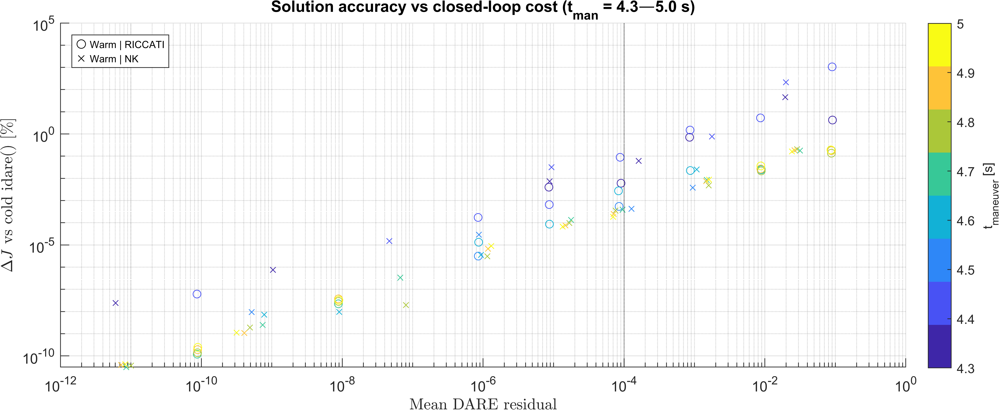
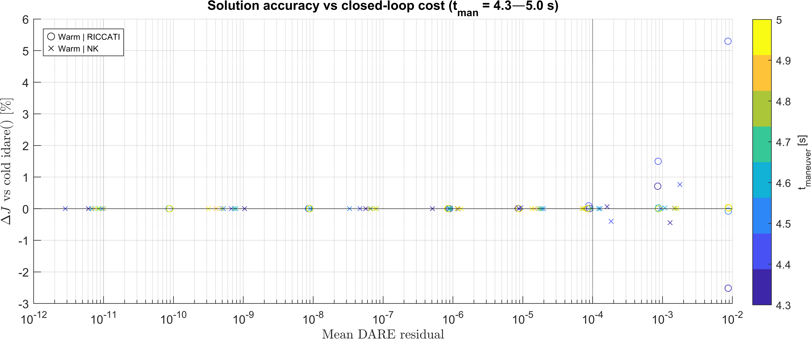
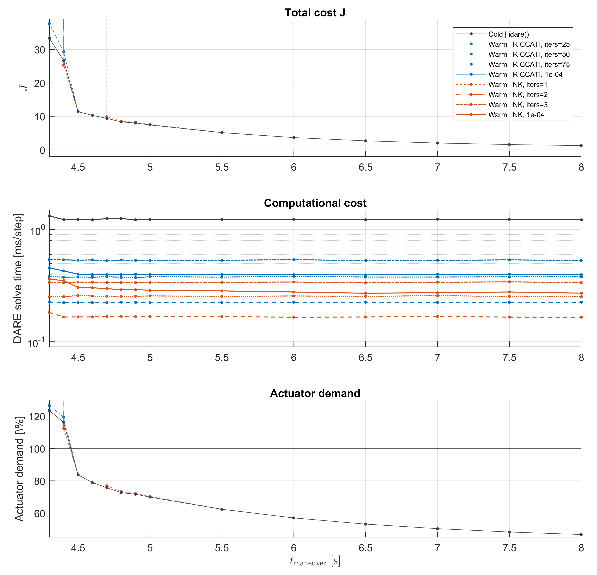
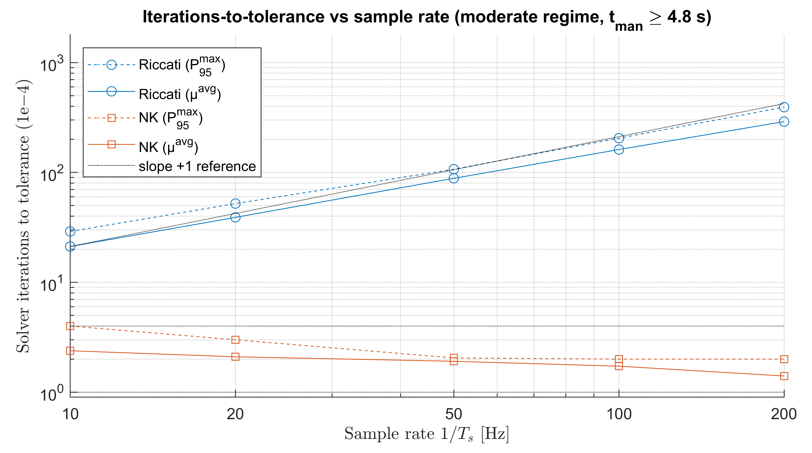
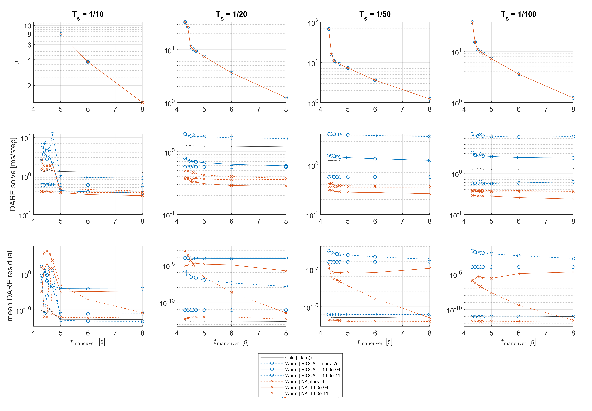

### Warm-started DARE solves: the TLDR2 version

This controller requires solving the DARE at each timestep – done via warm-started Newton–Kleinman with early-termination. ~4× faster than a cold `idare` solve, with no practical tracking penalty. Verified across the full flight envelope.

> If you're just using the defaults, that's the whole story. The rest of this document covers where those parameters came from and how much of it is tied to this particular system. It walks through the tuning basis, how solve accuracy trades against tracking cost, NK versus Riccati – enough to serve as a guide on how the parameters transfer beyond the default configuration.

## Warm-started DARE solves: TLDR version

A SDRE controller solves a discrete algebraic Riccati equation (DARE)

$$ P = A^{\top} P A - A^{\top} P B (R + B^{\top} P B)^{-1} B^{\top} P A + Q, \qquad K = (R + B^{\top} P B)^{-1} B^{\top} P A $$

at every control step: the SDC matrices $`(A,B)`$ change with state, so the feedback gain and cost-to-go matrices must be recomputed continuously.

This per-step DARE is solved by warm-started Newton–Kleinman iteration; because consecutive SDC models differ only slightly along a trajectory, warm-started solves via NK iteration reproduce a from-scratch `idare` solution at a fraction of the cost. Relaxing the solve tolerance (DARE residual) to $10^{-4}$ — roughly seven orders of magnitude short of a completed solve — further shaves off the compute.

Performance is verified against the `idare` baseline across the full flight envelope: NK iteration with $10^{-4}$ tolerance yields practically identical closed-loop tracking, at 70–80% lower compute.

NK iteration has one critical weakness however: the warm start seed $K_0$ must yield a stable closed loop with the *next* step's $(A,B)$. Under practical circumstances, not a problem; under fixed-iteration schemes with aggressive trajectories and slow loop rates, this failure mode can't be ignored. A Schur-stability check, combined with a cold solve or Riccati fallback, is necessitated here.

The cold solve fallback is retained in general – though if it's actually triggering, that indicates something amiss in the configuration, worth addressing before deployment: try the default solver options first.

**Section summaries:**

1. **Suboptimal residual thresholds.** Iterative DARE solvers admit early termination once the residual drops below a chosen threshold. A threshold of $`10^{-4}`$ yields no measurable tracking performance loss while enabling faster and more predictable solve times.

2. **Fixed iteration budget vs. early exit.** Riccati iteration and NK have different convergence guarantees: Riccati converges globally from any PSD $P_0$, NK only locally (the closed-loop $A - BK_0$ formed from the warm start must be stable). Fixed-iteration schemes, which bypass convergence and Schur-stability checks, therefore favour Riccati for robustness. Early-exit schemes safely exploit NK's quadratic convergence; the residual check essentially addresses the basin issue by preventing a bad solution from being propagated. A Schur-stability check triggers fallback if the basin is nonetheless lost; however, this points to misconfiguration and should never be required in practice – only retained as a loud-warning tool during development, and a worst-case guarantee in deployments.

3. **Riccati iteration vs. Newton–Kleinman.** NK is faster across the board. Riccati converges linearly and its per-step cost grows linearly with sample rate, making it slower than even a cold `idare` at moderate-to-high loop rates. NK's quadratic convergence keeps its cost flat and slightly decreasing with sample rate — it is the only practical iterative solver at moderate to high loop rates.

| DARE solver | Cost per step (20 Hz) | Cost trend with loop rate |
|---|---|---|
| Cold `dlqr()` | ~2.4 ms | flat |
| Cold `idare` | ~1.3 ms | flat |
| Warm Riccati iteration | ~0.4 ms | grows linearly (~4 ms at 200 Hz) |
| **Warm Newton–Kleinman (default)** | **~0.3 ms** | **flat / drifts down** (~0.23 ms at 200 Hz) |

**Design parameters:**

| Parameter | Value |
|---|---|
| DARE solver | NK |
| Residual tolerance | $10^{-4}$ |
| Min iterations | 1 |
| Max iterations | 10 |

 

> **Note:** the threshold was tuned against the *Quaternion* SDC factorisation. Near hover, attitude-coordinate magnitudes differ across representations (Euler/FRA ≈ θ, qvec ≈ θ/2, MRP ≈ θ/4), and `get_weights` compensates via $Q_y$-scaling — but the Riccati solution $P$ inherits both scalings, so a fixed absolute residual tolerance is not equally tight across representations. Applying a similarity transform $`T = \text{blkdiag}(I_6;\; s \cdot I_3;\; I_3)`$ with $`s \in \lbrace 1/2, 1, 2, 1/2 \rbrace`$ for {Euler, Quaternion, MRP, FRA} normalises the attitude block to a common coordinate scale, making the single threshold equally meaningful everywhere.

> **Note:** the threshold is specific to this system and cost matrices, since we're using the un-normalised DARE residual as the metric. Analysis of the normalised DARE residual computation yields more general results – independent of Q, R, and largely the closed-loop matrix too. However, the scope of this analysis is restricted to the unnormalised residuals; residual monitoring with full normalisation is unnecessary here and adds extra compute on each Lyapunov iteration – quickly adds up, preferably avoided on a microcontroller.

> **Note:** the benchmarks herein used MATLAB's built-in `idare` and `dlyap`. The current codebase replaces these with `dare_sda` and `dlyap_sda` – faster, but absolute timings will differ.

 

# Warm-started DARE solves: full version

The SDDRE controller (`compute_u_SDDRE_v3`) solves a discrete algebraic Riccati equation (DARE) at every control step: the SDC matrices $A(x_k)$, $B(u_{k-1})$ change with the state, so $P_{ss}$ and the feedback gain $K_{ss}$ must be recomputed continuously. This solve is a dominant compute cost of the controller, and its properties – speed, timing consistency, failure behaviour – largely determine whether the whole method is viable for embedded real-time deployment. This document benchmarks the solver strategies implemented in `iterative_dare.m` and explains the design choices that resulted.

The key structural observation: in general, consecutive SDC models differ only slightly, so the previous step's solution $P_{k-1}$ is an excellent initial guess for the current DARE. 
This admits *warm-starting* – a property a general interior-point QP or NLP solver does not share – and the design question becomes which iterative scheme to use (Riccati, NK), and which design parameters (MinIters, MaxIters, acceptable tolerance) are appropriate for a given use case.

It's a sharper answer than it first appears; NK and Riccati benefit from their warm-start seeds very differently, as we'll see throughout the rest of the analysis.

## Solvers compared

| Strategy | Per-iteration work | Convergence | Basin |
|---|---|---|---|
| `idare` (cold) | Direct solve, from scratch each step | – (direct) | – |
| Riccati iteration (warm) | One linear solve, one sweep of the DARE map (a few matrix products) | Linear | Global (seed from any PSD $P_0$) |
| Newton–Kleinman (warm) | One linear solve, one discrete Lyapunov solve (`dlyap`) | Quadratic | Local (the seed $A-BK_0$ must be stabilising) |

- One `dlyap` costs roughly 25 Riccati sweeps in wall time. Equal-cost comparisons therefore pit NK-$`n`$ against Riccati-$`25n`$.
- Each warm method is tested with fixed iteration counts (deterministic timing) and with an early-break variant (iterate until the DARE residual passes a tolerance).
- Residual throughout is the unnormalised form:

$$ \lVert A_{cl}^{\top} P A_{cl} - P + Q + K^{\top} R K \rVert_F $$

where $A_{cl} = A - BK$ and $K = (R + B^{\top}PB)^{-1}B^{\top}PA$.

## 1. Iterative solvers: how accurate does the DARE solve need to be?

Solving via MATLAB's `idare` yields a DARE residual of ~1e-11; for our `iterative_dare` solver, we choose a threshold of 1e-4, showing that early termination with this threshold does not tangibly degrade tracking performance.

First: with iterative solvers, it's certainly possible to target a similar accuracy of ~1e-11 — such benchmarks are also included later in section 3. However, it's largely unnecessary: optimal tracking performance does not depend on the DARE residual being minimised to machine precision. Early termination at an appropriate $\mathrm{dare\_residual}$ threshold enables lower compute requirements, and – with an appropriately chosen threshold – has no practical impact on tracking performance; fully solving the DARE to completion is not necessary.

The question then is where to – justifiably – set the threshold. This section thus establishes the relationship between DARE solve accuracy and closed-loop tracking cost, enabling an informed choice of the $\mathrm{dare\_residual}$ threshold used for early breaking in `iterative_dare`. The results herein also carry some additional generality to contexts beyond this project – when compute is limited and some suboptimality must be accepted, this analysis lets you gauge the expected impact on performance.

---

The graph below is the key result and was generated as follows:
- We sweep $t_{maneuver}$ = $4.3–5.0$ s. This corresponds to the *stressed regime*.
- For each $t_{maneuver}$, we complete a run with the controller in the loop, using either `nk` or `riccati` as the iterative solver. For each solver, we repeat this across several early break thresholds: $\mathrm{dare\_residual}$ below $10^p$, where $`p \in \{-10,-8,-6,-5,-4,-3,-2,-1 \}`$.
- For each ($`t_{maneuver}`$, solver, $`\mathrm{dare\_residual}`$ threshold) combination, we compute the mean DARE residual achieved over the trajectory. The closed-loop cost $J$ is then compared against the cold `idare` baseline: the relative discrepancy is $`|\Delta J|/J_0`$.

>Note that we run this test in the *stressed regime*, $t_{maneuver} = 4.3–5.0$ s, since here the accuracy of the DARE solution is most crucial. Throughout the stressed regime, full state feedback needs to counter the (significant, unmodelled) actuator saturation. Below 4.3s, the maneuver is infeasible – using any DARE solver – due to the effects of actuator saturation overwhelming the feedback controller's capacity. In general, the Riccati solution $P_{ss}$ needs to be accurate for the feedforward terms to be reliable, the feedback gain $K_{ss}$ is fully determined by $P_{ss}$, so the choice of DARE solver tolerance is best evaluated under the stressed regime, as the effects of inaccuracies are best highlighted here; in general, a more lenient threshold and more suboptimal DARE solution is acceptable, however for informed robust design, we deliberately evaluate over this regime (conservative results) to ensure reliability over the full operating envelope – up to infeasible tracking.

Each point in the scatter plot below therefore has (x,y) coordinates (mean_dare_residual_after_solve, measured_performance_impact).

  

*Figure 1 – DARE residual vs closed-loop cost discrepancy* $`|\Delta J|/J_0`$ *relative to the cold `idare` baseline.*

From the figure we can see:

- The relationship follows a power law over the full ten orders of magnitude: $`|\Delta J|/J_0 \approx c \cdot \mathrm{dare\_residual}^{\alpha}`$ with $\alpha \approx 1\text{–}1.2$ (slightly superlinear).
- NK and Riccati points fall on the same trend. Only the residual magnitude matters – not the method that produced it.
- Below residuals of $\approx 10^{-4}$, the tracking performance is near-optimal – bounded within 0.1% of the true optimum. Operating above this residual level runs the risk of tracking degrading unacceptably. At residuals $\approx 10^{-1}$, J is ~1% worse on average across the stressed sweep, but *up to ~1000% higher* in the worst case – corresponding to the hexacopter *losing closed loop stability* and failing to complete the maneuver (the one outlier Riccati sample point, $`t_{man} = 4.4`$ s).

Numerically: worst-case cost discrepancy vs cold `idare`, over the stressed sweep ($t_{man}$ = 4.3–5.0 s):

| Requested tolerance | Riccati: worst $\Delta J$ | NK: worst $\Delta J$ |
|---|---|---|
| 1e-1 | **+1060%** (detonation, $t_{man}$=4.4) | **+214%** (detonation, $t_{man}$=4.4) |
| 1e-2 | +5.3% | +0.8% |
| 1e-3 | +1.5% | −0.4% |
| **1e-4** | **+0.09%** | **+0.03%** |
| 1e-5 | +0.001% | −0.005% |
| ≤1e-6 | indistinguishable | indistinguishable |

**A residual tolerance of $10^{-4}$ bounds the cost penalty below 0.1%** (point-of-failure maneuvers), and most often yields tracking suboptimality below 0.01% (adjacent maneuvers). Solving beyond this costs compute and buys nothing measurable; the dominant error becomes the formulation (input saturation the DARE never saw), not the accuracy of the solve.

This target, $\mathrm{dare\_residual}$ $\leq 10^{-4}$, is thus generally used as the early-break threshold (when early break is enabled) in the iterative DARE solver.

> **Note: the table is keyed to *requested* tolerance; the figure's x-axis is *achieved* residual.** The two methods land differently relative to the request. Riccati's linear convergence closes the gap in small steps, so it stops just under the line – achieved residual sits tightly at the requested tolerance (e.g. requesting 1e-2 achieves ~9e-3). NK's quadratic steps overshoot: each iteration roughly squares the error, so the final step lands well past the threshold (requesting 1e-2 typically achieves ~1e-3 on average, a decade better than asked). This is why NK's penalties in the table look better than Riccati's at equal requested tolerance – NK's quadratic convergence is delivering a more accurate solution than requested. On the figure's *achieved*-residual axis, both methods fall on the same trend, consistent with the observation above that only the residual magnitude matters.

> **Note: the actual $\Delta J$ discrepancy is signed.** The figure's log scale hides this, but $\Delta J$ is not always positive – some suboptimal runs actually *beat* the exact-solve baseline.
>
> This looks strange at first (how can a worse solve give better tracking?), but it follows from what the DARE actually optimises. In short, the exact solve via `idare` is a reference point, not the true minimiser: the exact solution $P_{ss}$ is optimal for the problem it solves, while the cost $J$ is measured on the real problem (unmodelled dynamics, saturating actuators, finite horizon). These are different problems, so the exact-solve gain is not the true minimiser of $J$ – it is just a (very good) reference point for evaluating the effects of our early-terminated DARE solutions.
>
> Mechanistically: around a point that is not a minimum, a small perturbation to the gain can move $J$ in either direction: slightly downhill or slightly uphill. An under-converged solve is exactly such a perturbation. Sometimes it happens to land downhill – for example, an under-converged $P$ tends to give a slightly softer gain, which demands less from the actuators, which clips less against the saturation limits the DARE never knew about.
>
> It's only observed in the *stressed regime* where actuator saturation occurs – an artifact that trends away as the trajectory and cost landscape match what the DARE solver is actually optimising for, as evidenced by the correlation with DARE solve tolerance. Nevertheless, an interesting artifact and worth noting. See below.

  

## 2. Iterative solvers: fixed iteration schemes, versus residual-based

  

*Figure 2 – Sweep over maneuver duration $`t_{man}`$ at $`T_s = 1/20`$, quaternion SDC. Top: closed-loop cost. Middle: DARE solve time per step. Bottom: actuator demand – above ~100%, saturation acts as an unmodelled disturbance and the feedback gain becomes load-bearing.*

In Figure 2, the actuator demand panel (bottom) illustrates the regime map: higher actuator demand corresponds to a more difficult maneuver, which in turn increases the stress on the DARE solver and the criticality of its solution accuracy. We consider the *benign regime* as $t_{man} \geq 5.0$, *stressed regime* as $t_{man} = 4.5–4.9$, *highly-stressed* regime as $t_{man} = 4.3–4.4$ s: in the latter case, actuators are saturating significantly (the maneuver becomes infeasible below 4.3 s). As regime stress increases, the warm start degrades and errors compound across timesteps; it is in these harder regimes that the solver variants separate:

- In the benign regime, every solver variant – including NK with a single iteration – matches the cold `idare` cost almost exactly; the warm start is good enough that almost any amount of polishing suffices.
- Across the stressed and highly-stressed regimes, the under-budgeted NK variants (1 and 2 iterations, respectively) detonate (that is, the cost explodes, corresponding to the hexacopter losing closed-loop stability) – the pure-vertical spikes in the cost panel. This is the hard failure mode analysed later on. NK with 3 iterations, along with its early-break variant, completes every run at baseline cost.
- Solve time is where the variants actually separate: early-break NK sits around 0.3 ms/step against ~1.25 ms for cold `idare`, with the Riccati variants in between. For these variants, the cost panel says suboptimal DARE accuracy is largely free, with the under-budgeted solvers completing the maneuver practically just as well despite early termination (often indistinguishable $\Delta J$, and surviving the full operating envelope up to infeasibility).

See below for the numerics (per solver, median compute time).

| Solver | Benign: ms/step | Stressed: ms/step | Stressed outcome | Worst $\Delta J$ |
|---|---|---|---|---|
| `idare` (cold) | 1.23 | 1.27 | baseline | — |
| Riccati, iters=25 | 0.22 | 0.23 | +13% ***cost penalty*** ($t_{man}$=4.3) | +13.1% |
| Riccati, iters=50 | 0.38 | 0.38 | completes, $\Delta J$ <0.3% | +0.2% |
| Riccati, iters=75 | 0.53 | 0.54 | completes | — |
| Riccati, tol 1e-4 | 0.40 | 0.45 | completes | — |
| NK, iters=1 | 0.17 | 0.18 | ***diverges*** | – (detonates) |
| NK, iters=2 | 0.25 | 0.25 | diverges at 4.3 s; survives 4.4+ | – (detonates) |
| NK, iters=3 | 0.34 | 0.34 | completes | — |
| **NK, tol 1e-4** | **0.28** | **0.36** | **completes** | **—** |

*Key: in the rightmost column, — indicates within margins (< 0.01%).*

The failure-mode asymmetry visible in the table is worth noting — at roughly equal wall time, fixed-iteration Riccati (25–50 iters) degrades gracefully with a cost penalty, while fixed-iteration NK (1–2 iters) either matches baseline exactly or detonates, with absolutely no in-between — and is worth examining more closely.

> **Note:** NK with 2 iterations at $t_{man}$ = 4.4 s actually *beats* the cold baseline (J = 25.2 vs 26.4, $\Delta J$ = −4.5%). This is the signed-penalty artifact from Section 1 – an under-converged gain happens to clip less against the saturation limits. It occurs at exactly the point where one step less aggressive ($t_{man}$ = 4.3 s) causes full detonation. Near the basin boundary, the same mechanism that can land you slightly downhill can also land you off a cliff.

> **Note:** NK with 1 iteration was the only variant that showed *any* cost discrepancy in the benign regime – J = 7.5 vs the 7.4 baseline at $t_{man}$ = 5.0 s, J = 3.7 vs the 3.6 baseline at 6.0 s. Not detonation, but a persistent ~1–3% penalty due to residuals sitting at ~1e-2 to 1e-1: one Newton step from a warm start simply doesn't close the gap, even when the gap is small and the basin is safe. Two iterations eliminates this entirely.

### NK's failure mode: leaving the stabilising basin

NK's Lyapunov step is only meaningful if the current gain stabilises the current model. `dlyap` performs no stability check: if $\rho(A - BK) > 1$, it returns a matrix that is not a valid cost-to-go, the next gain is built from it, and the iteration compounds – the closed loop diverges within a few steps. Eigenvalue checks and fallbacks are easily accommodated for in code, but complicate timing guarantees, and Riccati's robustness – global convergence from any PSD seed $P_0$ – has a major advantage in this regard: Riccati naturally suits the lower sample rate, aggressive maneuver situations, where the assumption on SDC matrices changing at a bounded rate between controller updates is at its weakest.

(Kleinman/Hewer): from a stabilising seed, every NK iterate is stabilising and convergence is monotone and *quadratic*. The compute advantages of NK over Riccati are clear from the table and the plot. But the basin is the set of stabilising gains, not all positive-semidefinite matrices, and its boundary is invisible until crossed. During aggressive maneuvers the SDC matrices change quickly between steps, the warm start goes stale, and one or two Newton steps are not enough to stay inside.

The two methods therefore fail differently. **Riccati iteration fails soft**: it converges from any positive-semidefinite seed, so under-iterating gives a sloppy solution (~10% cost penalty at worst here), never divergence of the solver itself. In contrast, **NK fails hard** – without eigenvalue checks, the 1- and 2-iteration cases diverge outright.

But NK never fails from inside its basin; a fixed budget of 3 iterations (empirically, in this regime – further analysed across other regimes in Section 3) is sufficient to guarantee remaining inside. Further, the early-break variant is implicitly guarded: a diverging iterate cannot pass the residual check, so the solver keeps iterating toward recovery instead of committing a bad solution and detonating on subsequent iterations.

An explicit guard for the fixed-budget variant is cheap: check $\rho(A - BK) < 1$ before the `dlyap` (a 12x12 eigendecomposition, tens of microseconds – or integrated as part of the solve itself in a custom Lyapunov solver), and fall back to a cold `idare` on failure – the worst-case per-step cost stays predictably bounded, and a guaranteed fresh solution is provided to restart the warm solver. This is only necessitated for NK (Riccati may benefit also, but that's outside of this analysis's scope).

The fallback itself admits two options: a cold `idare` solve, or a Riccati iteration from the warm-start $P_0$. A cold solve's compute profile is fully deterministic, but slowest; Riccati takes advantage of the warm start and sits somewhere in between NK and a cold solve, at the cost of variable timing. Note however that Riccati as a fallback is only viable at low loop rates (below 50 Hz): its convergence rate, combined with closed-loop eigenvalues approaching the unit circle as $T_s \to 0$, make for a counterintuitive result; warm-started Riccati solves are *slower* than a cold solve via `idare` at 50 Hz and above (see Section 3). Thus at moderate-to-high rates, a cold solve is the only practical fallback.

> The `idare` fallback route was disabled for the analysis herein, but it is included in the code – with loud warnings when activated: useful during development, and a hard safety net in implementations. A properly-configured solver never triggers it.

## 3. Iterative solvers: scaling with sample rate

### 3.1: Iterations-to-tolerance versus $T_s$. Riccati and NK, both early breaking with tol=1e-4.

The key result is that Riccati's compute cost **grows linearly** with sample rate; NK's ***stays mostly flat*, and actually *drifts down*** as the sampling rate is increased.

The figure below sweeps sample rate $T_s = 1/10$ to $1/200$ with the early-break tolerance fixed at $10^{-4}$, and reports iterations-to-tolerance two ways:

- $\mu^{avg}$ – the mean iteration count, averaged within each run and then across the $t_{maneuver}$ sweep. This is the typical per-step cost.
- $P_{95}^{max}$ – the 95th-percentile iteration count within each run, then the worst case of that across the sweep. This is a conservative envelope: it captures the bursty steps (aggressive parts of the maneuver, where the warm start is most stale) that the mean hides. It is deliberately pessimistic – worst-of-p95, not typical-p95.

Reporting both matters because the two methods have different error character: Riccati's iteration count sits tightly at whatever the tolerance demands, while NK's is bursty – occasional steps need noticeably more work than the mean suggests.

  

*Figure 3 – Iterations required to reach target DARE residual ($`10^{-4}`$) versus sample rate, log-log scale. Slope +1 reference indicates the expected growth rate for the Riccati iterative solver. Black horizontal lines mark the 1-4 iteration count band, the typical iteration bounds for NK across any regime.*

> NB: The analysis is restricted to $t_{maneuver} \geq 4.8$ s here, as opposed to earlier's analysis at 4.3s minimum: 4.8s is the fastest feasible time the maneuver can be completed with a loop rate of 10Hz (using any solver, including `idare`), and the compute trend is best illustrated across a wider range of loop rates that includes 10Hz as presented.

Both methods receive better seeds at higher loop rates; the warm-start error scales with how far the state moves per step, roughly proportional to $T_s$. But the Riccati iteration contracts the error by a constant factor $\rho(A_{cl})^2$ per step, and the closed-loop poles approach the unit circle as $T_s \to 0$, so as $T_s \to 0$ its per-iteration progress begins to collapse – the key reason for the linear scaling seen in Figure 3.

NK, in contrast, benefits from both effects with no offsetting penalty: its convergence rate is set by the quality of the seed, not by the spectral radius of $`A_{cl}`$, so as $T_s \to 0$ the shrinking warm-start error feeds directly into quadratic convergence – a closer seed means near-immediate convergence. The two methods' costs therefore diverge exactly where it matters: **faster loop rates make Riccati more expensive and NK cheaper**. NK's safety improves with rate too: basin exit is driven by warm-start staleness, and staleness shrinks with $T_s$, so a fixed-but-low NK budget becomes safer with higher loop rates.

### 3.2: Compute versus $T_s$. Riccati and NK, early breaking with tol $\in\{10^{-4},10^{-11}\}$.
Precise compute times are tabulated below. The table reports the median solve time, averaged across the maneuver runs – $\mathrm{t\_maneuver} \in [4.3, 4.4, 4.5, 4.6, 4.7, 5.0, 6.0, 8.0]$.

Results are included for both:
- the DARE solved to the nominal tolerance, 1e-4,
- the DARE solved to a tolerance of 1e-11 (roughly machine-precision, matching `idare`'s accuracy for directly comparable compute times).

| Sample rate | Riccati 1e-4 | Riccati 1e-11 | NK 1e-4 | NK 1e-11 | Cold `idare` |
|---|---|---|---|---|---|
| 10 Hz | 0.39 ms | 0.91 ms | 0.34 ms | 0.44 ms | 1.27 ms |
| 20 Hz | 0.63 ms | 1.67 ms | 0.29 ms | 0.40 ms | 1.22 ms |
| 50 Hz | 1.33 ms | 3.92 ms | 0.27 ms | 0.38 ms | 1.21 ms |
| 100 Hz | 2.43 ms | 7.71 ms | 0.26 ms | 0.38 ms | 1.27 ms |
| 200 Hz | 4.21 ms | 14.38 ms | 0.23 ms | 0.37 ms | 1.34 ms |

### 3.3: Full picture: tracking error, compute, and DARE residuals across $T_s$ (including both early break and fixed-iteration schemes).

Figure 4 shows the full picture behind the iteration-count summary: cost, solve time, and achieved residual across the $t_{maneuver}$ sweep.

  

*Figure 4 – Full comparison at $`T_s = 1/10, 1/20, 1/50, 1/100`$ (columns): tracking cost (top), DARE solve time (middle), DARE residual (bottom). Early-break variants here run to tolerance $`10^{-4}`$ and $`10^{-11}`$. Fixed-iter variants (no residual checking) are run for 3 iters (NK) and 75 iters (Riccati), chosen for roughly equal wall time.*

- **Top row (cost):** all solver variants lie on the same curve at every sample rate – consistent with Section 1, any solver reaching the $10^{-4}$ residual gives tracking indistinguishable from baseline.

> A note on the visible gap at $T_s = 1/10$: here the feasibility floor moved from ~4.3 s to ~4.8–5 s for *all* solvers, including cold `idare` – at 10 Hz, there is simply not enough bandwidth to both track the aggressive maneuver and compensate for the unmodelled actuator saturation, regardless of how the DARE is solved. The cost detonated past this point; those runs were excluded from the $`J`$ plot for clarity.

- **Middle row (solve time):** the scaling story of Figure 3, here illustrated in compute time instead of iteration counts. Riccati-to-tolerance climbs with loop rate; NK-to-tolerance drifts down. By $T_s = 1/100$, both early-break Riccati variants are the most expensive; the NK variants are all cheapest. Cold `idare` is flat around 1.3 ms as expected (it does the same work regardless of loop rate).

- **Bottom row (residual):** the early-break variants land close to their requested tolerance, with NK overshooting further past it (quadratic steps overshoot; linear steps stop near the line). The fixed-budget variants drift with regime, visible as the *sloped* dashed lines – partly why early-break methods are the recommended approach. Fixed iteration schemes are also possible, but require more careful upfront design across the full operating envelope.

## 4. Conclusion

`compute_u_SDDRE_v3` defaults to **warm-started Newton–Kleinman with early break at residual $10^{-4}$, minimum 1 and maximum 10 iterations**:

- In practice the solver runs at ~0.3 ms/step, ~4× cheaper than cold `idare`, and the residual check doubles as a divergence guard.
- The tolerance comes directly from the Section 1 analysis: $10^{-4}$ bounds the cost penalty to 0.01–0.1%, below significance.
- MinIters = 1 and MaxIters = 10 are generic defaults; early break handles termination, and the cap is a generous overbound – ensures reaching tolerance is the exit condition (not hitting an iteration limit). The minimum of 1 ensures the solution is at least partially updated at each control step, for solution freshness and more consistent timing. Both can be tailored per-regime using the analysis herein as a guide.
- To mitigate the stability basin issue, NK is used with the early-breaking config. Alternatively – for fully consistent timing – set a sufficiently high iteration count: sections 2 and 3.3 showed how at both 10Hz and 20Hz control, a fixed iteration count of 3 kept NK within its stability basin across all feasible maneuvers.
- Riccati iteration is retained but not recommended in general: its global convergence properties are strong, and advantageous in the edge cases, however it is never simultaneously as fast and as accurate as NK, and its cost per tolerance grows with sample rate – NK *favours* higher sample rates.
- Cold `idare` remains the bootstrap (first step), and is retained for any fallbacks – with loud warnings. The cold solve fallback provides recovery from an invalid seed – but if it's actually triggering, this indicates something amiss in the design and is worth addressing before deployment: a properly configured problem never triggers fallbacks.

